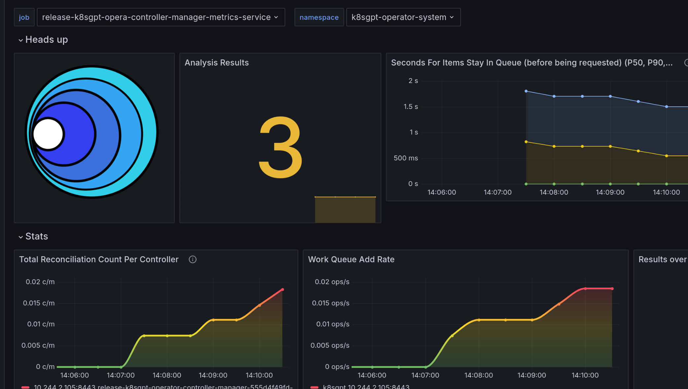

# Integrating Observability with K8sGPT

Enhance your Kubernetes observability by integrating Prometheus and Grafana with K8sGPT. Follow these steps to set up and visualize your cluster's insights:
## Prerequisites
- Prometheus: Install using Helm via Prometheus Community Helm Charts.
- Grafana Dashboard: Ensure Grafana is installed and accessible in your environment.

# Installation Steps

Install the K8sGPT Operator with observability features enabled:
```
helm install release k8sgpt/k8sgpt-operator -n k8sgpt-operator-system --create-namespace --set interplex.enabled=true --set grafanaDashboard.enabled=true --set serviceMonitor.enabled=true
```
This command:
- Creates a ServiceMonitor to integrate with Prometheus.
- Automatically configures and populates data into your Grafana dashboard.

Once set up, you can explore key metrics like:
- Results identified by K8sGPT.
- Operator workload details, providing insight into resource usage and efficiency.


_See example of a K8sGPT Grafana dashboard_

