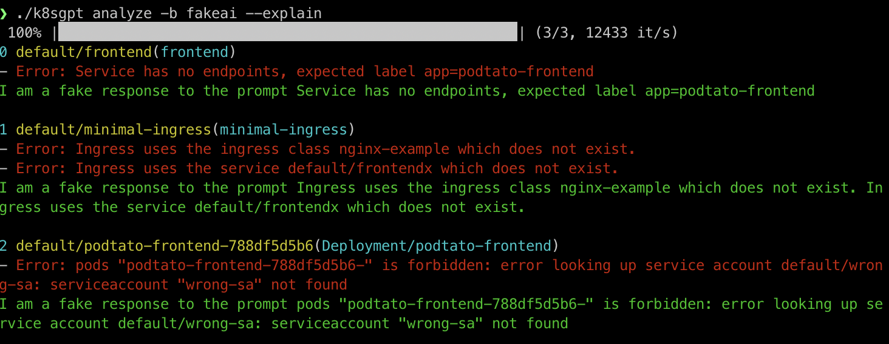

# NoOpAiProvider

NoOpAiProvider is a FakeAI Backend Provider used in k8sgpt. This may be useful in certain situations where you need to test a new feature or simulate the behaviour of an AI based-system without actually invoking it. It can help you with local devlopment, testing and troubleshooting.

## How does NoOpAiProvider works?

The NoOpAiProvider does not acutally perfornm any AI-based operations but simulates them by echoing the input given as a problem.

An example of the output can be seen below:



## Working with NoOpAiProvider

Follow the steps outlined below to learn how to utilize the NoOpAiProvider:

- Authorize k8sgpt with `noopai` or `noop` as the Backend Provider.
```
k8sgpt auth -b noopai
```
- For the auth token, you can leave it blank as the NoOpAiProvider is configured to work fine with or without any token.

- Use the analyze and explain command to check for errors in your kubernetes cluster and the NoOpAiProvider should return the error as the solution itself.
```
k8sgpt analyze --explain
```
